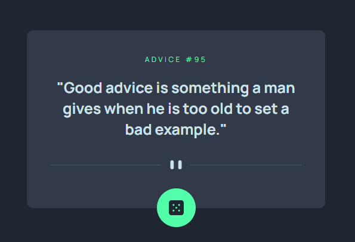

# Frontend Mentor - Advice generator app solution

This is the solution I came with:

## Table of contents

- [Overview](#overview)
  - [The challenge](#the-challenge)
  - [Screenshot](#screenshot)
  - [Links](#links)
- [My process](#my-process)
  - [Built with](#built-with)
  - [What I learned](#what-i-learned)
- [Author](#author)

## Overview

### The challenge

Users should be able to:

- View the optimal layout for the app depending on their device's screen size
- See hover states for all interactive elements on the page
- Generate a new piece of advice by clicking the dice icon

### Screenshot

### Links

- Solution URL: [URL to github repo](httphttps://github.com/Manufacturer1/advice-generator-app)
- Live Site URL: [Website url](https://advice-generator-d9fp9506y-manufacturer1s-projects.vercel.app/)

## My process

### Built with

- Semantic HTML5 markup
- CSS custom properties
- [React](https://reactjs.org/) - JS library
- [Tailwind](https://tailwindui.com/)

### What I learned

It was a really interesting project for me!

I'm really proud that I could add a loading spinner as an aditional task to the challenge.

## Author
- Github - [Manufacturer1](https://github.com/Manufacturer1/advice-generator-app)
